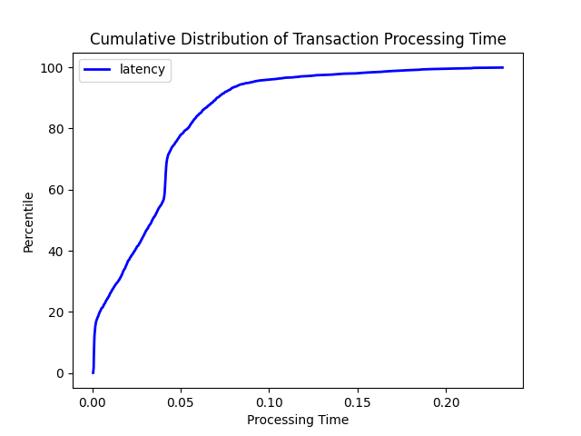

# MP 1 - Event Ordering

## Team Details
* Cluster 45
* Git Repo:
* Git Revision:

## Group Members
* Neil Kaushikkar (neilk3)
* Neha Gogate (ngogate2)

## Build Instructions:

1. You must first have the Rust compiler (rustc) and Cargo installed. You can either run `curl --proto '=https' --tlsv1.2 -sSf https://sh.rustup.rs | sh` to install these or visit https://www.rust-lang.org/tools/install for more installation options. Follow the instructions for the default installation of Rust when prompted.
2. If you are installing Rust for the first time, you will also need to run the following command to add `cargo` to your path for the current shell/session: `source "$HOME/.cargo/env"`
3. Run `make` in the project root directory. This will build `./mp1_node`

## Running Instructions:
To start each node, type `./mp1_node [node name] [name of config file]` 

## Evaluation Scenarios
This is run on each node - the number of nodes specified in the config file passed in as a parameter. It will fail and terminate if any node crashes, or successfully complete if no nodes fail. Transactions and deposits will be evaluated and then processed, and node balances will be updated and printed after every event. We created 

### 3 nodes with failure

### 3 nodes with NO failure

### 8 nodes with failure

### 8 nodes with NO failure

