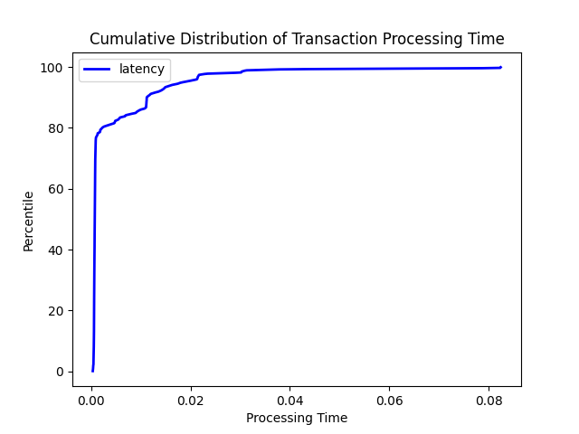
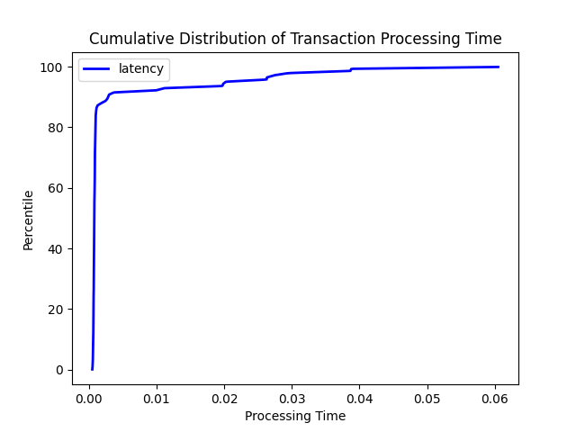
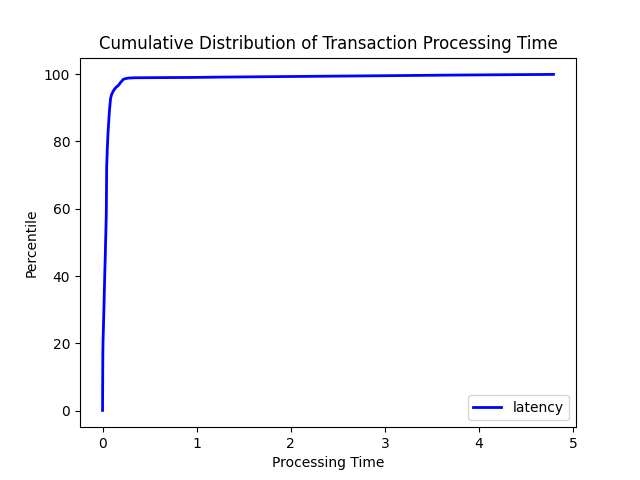

# MP 1 - Event Ordering

## Team Details
* Cluster 45
* Git Repo:
* Git Revision:

## Group Members
* Neil Kaushikkar (neilk3)
* Neha Gogate (ngogate2)

## Build Instructions:

1. You must first have the Rust compiler (rustc) and Cargo installed. You can either run `curl --proto '=https' --tlsv1.2 -sSf https://sh.rustup.rs | sh` to install these or visit https://www.rust-lang.org/tools/install for more installation options. Follow the instructions for the default installation of Rust when prompted.
2. If you are installing Rust for the first time, you will also need to run the following command to add `cargo` to your path for the current shell/session: `source "$HOME/.cargo/env"`
3. Run `make` in the project root directory. This will build `./mp1_node`

## Running Instructions:
To start each node, type `./mp1_node [node name] [name of config file]` 

## Design

We built our distributed ATM service using a total-ordered (TO)multicast message service. This TO-multicast is built on top of a reliable multicast service (which is built on top of a basic multicast service). 

This ATM service listens for transactions on the command line. Once a user enters a transaction, the service broadcasts a request for a message priority to all other nodes. Once it receives priority suggestions from all active nodes, it selects the highest one, processes the transaction locally, and broadcasts the agreed priority to all other nodes to process. This service also listens for requests to assign transactions originating on other nodes a priority and replies with a suggested priority higher than any proposed or agreed priorities the node has seen. It also listens for agreed priorities for messages from other nodes and delivers these messages upon receipt of an agreed priority. This system ensures the ordering of transactions is consistent across all nodes. Since all banks processes "see" every transaction in the same order, all bank processes will process invalid transactions in the same manner and discard them. 

The TO-multicast is built on top of a reliable multicast that ensures that if one node delivers a message, then all other nodes will deliver the message. This reliable multicast service works by forwarding any unseen messages to all other nodes, barring the original sender and the node that forwarded the message, if applicable. This design ensures that transactions remain consistent across all nodes even if a node dies before notifying other nodes of a transaction. If a node `A` delivers a message to another node `B` before shortly dying, then `B` will forward the message to all other known alive node in the system. 

This system, however, implements reliable multicast in a different manner than shown in lecture. Collecting all messages ever received in a local data structure to check whether some message has been delivered before is very wasteful and redundant. It uses too much memory in the long run since the data structure is never cleared. Our design assigns a unique identifier to every message ever generated in the system with a tuple of the originating sender's unique id and the sequence number of the message on the originating sender (the first message sent has sequence number 0, the second has sequence number 1, etc). Since TCP is a FIFO channel, if some node `A` has received a message originating from node `B` with sequence number `n` (either forwarded or directly from `B`), then node `A` must have received the message originating from node `B` with sequence number `n-1` either from B or forwarded on behalf of node `B`. 

This means that we only need to keep track of the sequence number of the last message originating from each node in the system instead of keeping track of all messages every sent in the system when deciding whether or not to forward a message to other nodes on behalf of some other sender. Our reliable multicast service does exactly this. It tracks the last sequence number received from every other node in the system. The service will only deliver a message and forward a message on to other nodes if the sequence number received is larger than the stored sequence number. FIFO ordering guarantees that we will receive all sequence numbers in order, as well. 

Our service also monitors for any node failures. Upon a node's failure, the TO-multicast service initiates a 4 second timeout (based on the assumption that messages take at most 4 seconds to travel one way between nodes). During these 4 seconds, the service processes any messages that may be forwarded on behalf of the node that died, if any. Once the timeout is up, the service will remove all messages originating from the dead node from its priority queue of messages to deliver. It also stops waiting for any proposed priorities from the dead node and delivers any messages that may be stuck since they are waiting on a proposed priority from the dead node. The node that just died will no longer be delivering messages, so all other nodes no longer need to wait for a proposed priority to ensure total ordering on the dead node. The system only needs to wait for priorities from alive nodes, so we can flush the system of all pending messages from the dead node after our timeout since any straggling messages from the dead node will be delivered before the timeout expires.

## Evaluation Scenarios
This is run on each node - the number of nodes specified in the config file passed in as a parameter. It will fail and terminate if any node crashes, or successfully complete if no nodes fail. Transactions and deposits will be evaluated and then processed, and node balances will be updated and printed after every event. We created 

### 3 nodes with failure

### 3 nodes with NO failure

### 8 nodes with failure

### 8 nodes with NO failure

